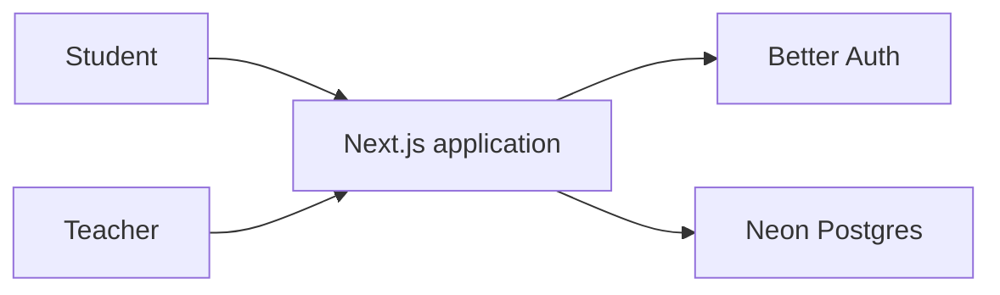
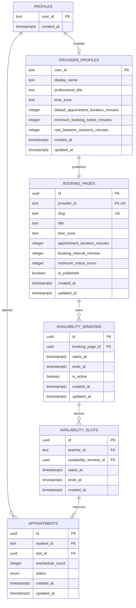

# PeerSlot

Policy-aware scheduling for student meetings.

PeerSlot is a small scheduling application for teachers, tutors, mentors, and
student-support teams. Teachers publish the times when they are available, and
students can move an existing appointment without asking an administrator to do
it manually.

Unlike a general-purpose booking link, PeerSlot is built around educational
rules. The first version focuses on a deliberately narrow workflow:

- A student may reschedule an appointment only once.
- The change must happen more than 24 hours before the current appointment.
- The replacement must be an available future slot with the same teacher.
- Two students can never claim the same slot.

> [!NOTE]
> PeerSlot is in active development. Provider authentication, onboarding,
> booking pages, availability calculation, and the localized provider workspace
> are in place. The student appointment and rescheduling workflow is still being
> implemented.

## The problem

Student meetings are often recurring or assigned in advance. When a student
needs a different time, a teacher or coordinator has to check availability,
move the meeting, notify everyone, and ensure the change does not create a
conflict.

PeerSlot makes that process self-service while keeping the teacher's scheduling
policy in control.

## Core workflow

1. A teacher creates free-time windows that derive meeting slots.
2. A student signs in and sees their upcoming appointment.
3. PeerSlot determines whether that appointment may be changed.
4. The student chooses from valid, unoccupied alternatives.
5. The server performs the change atomically.
6. The appointment records that its one permitted reschedule has been used.

## Planned MVP

### Student experience

- Sign in securely
- View the next scheduled meeting
- See whether the meeting is eligible for rescheduling
- Browse valid replacement times
- Confirm a one-time appointment change
- Receive useful feedback when a slot becomes unavailable

### Teacher experience

- Create, preview, edit, publish, and remove availability windows
- Review upcoming appointments
- View open times and recent booking notifications
- Manage booking-page publication and scheduling defaults

### Scheduling guarantees

- One reschedule per appointment
- A strict 24-hour cutoff
- No double-booking
- Server-side authorization for every protected operation
- Database constraints for shared scheduling state
- UTC storage with timezone-aware presentation

## Tech stack

The repository currently uses:

| Area            | Technology                                                                       |
| --------------- | -------------------------------------------------------------------------------- |
| Framework       | [Next.js 16](https://nextjs.org/) App Router                                     |
| Language        | [TypeScript](https://www.typescriptlang.org/)                                    |
| UI runtime      | [React 19](https://react.dev/)                                                   |
| Styling         | [Tailwind CSS 4](https://tailwindcss.com/)                                       |
| Localization    | [next-intl](https://next-intl.dev/)                                              |
| Database        | [Neon Postgres](https://neon.com/)                                               |
| Database driver | [`@neondatabase/serverless`](https://neon.com/docs/serverless/serverless-driver) |
| ORM             | [Drizzle ORM](https://orm.drizzle.team/)                                         |
| Authentication  | [Better Auth](https://www.better-auth.com/) persisted in Neon                    |
| Package manager | [pnpm](https://pnpm.io/)                                                         |

Better Auth provides email/password sessions, short-lived JWT access tokens,
and optional Google and Facebook OAuth. PeerSlot application APIs accept
15-minute JWTs; the revocable Better Auth session is used to issue and refresh
them. Public verification keys are exposed through JWKS. Authentication
establishes who the user is. Provider onboarding creates a profile and one
public booking page with an eight-character slug. The profile grants the
capability to publish availability, while every authenticated user can book
appointments.

FullCalendar and Resend are installed for the later calendar and notification
work, but are not integrated into the current UI yet.

## Architecture

PeerSlot is designed as a modular Next.js monolith. React and the App Router
provide the user interface, server actions or route handlers enforce the
application rules, and Neon Postgres owns durable scheduling state.



There is no separate microservice backend in the MVP. Keeping the application
in one TypeScript codebase makes the project faster to build and easier to
deploy while the workflow is being validated.

## Initial data model

Better Auth manages its authentication records in Neon. PeerSlot initially
uses six application tables:



The appointment's `slot_id` will be unique so PostgreSQL, rather than a
browser-side check, prevents double-booking. The database will also constrain
`reschedule_count` to `0` or `1`.

Each provider has exactly one booking page in the MVP. Its unique
eight-character slug is a public locator, not an authentication credential.
Providers can publish or hide the page and rotate the slug immediately if a
link is compromised.

Providers enter free-time windows in their booking-page time zone. The API
stores the instants as UTC-backed `timestamptz` values and derives individual
appointment starts using the page's duration and booking interval. Active
windows cannot overlap. Disabling a window removes its unbooked derived slots;
windows and slots referenced by appointments are retained for history.

The public availability service accepts a booking page and UTC date range,
loads its active windows, and returns ordered appointment times that fit fully
inside those windows and the requested range. It applies minimum notice,
scheduled-appointment, and disabled-window rules server-side. Each result
includes English and Turkish labels formatted in the provider's time zone. For
the MVP, appointment duration and booking interval must be equal so generated
times cannot overlap.

An audit table for reschedule history can be introduced after the basic
workflow is working.

## Rescheduling safely

The reschedule operation must be one server-controlled database operation. It
will update an appointment only when all of these conditions are true:

1. The signed-in student owns the appointment.
2. The appointment is still scheduled.
3. Its reschedule count is zero.
4. Its current start time is more than 24 hours away.
5. The new slot is in the future and belongs to the same teacher.
6. The new slot is not occupied.

If two requests race for the same replacement slot, a unique database
constraint allows only one to succeed.

## Getting started

### Prerequisites

- Node.js 20 or newer
- pnpm

### Install and run

```bash
git clone <repository-url>
cd peerslot
pnpm install
pnpm dev
```

Open [http://localhost:3000](http://localhost:3000).

Provider registration and sign-in are available at
`http://localhost:3000/en/auth/provider`. Email/password, Google, and Facebook
authentication all continue into the same setup form. It defaults rest time to
10 minutes, creates the provider's booking page, and redirects to the dashboard.

### Localization

The website is available in English at `/en` and Turkish at `/tr`. Visiting
the root URL selects a locale from the saved preference or the browser's
language and redirects to the matching localized route. Page copy and metadata
live in `messages/en.json` and `messages/tr.json`. API routes remain unprefixed
under `/api`.

### Available commands

| Command                            | Purpose                                   |
| ---------------------------------- | ----------------------------------------- |
| `pnpm dev`                         | Start the local development server        |
| `pnpm build`                       | Create a production build                 |
| `pnpm start`                       | Run the production build                  |
| `pnpm lint`                        | Run ESLint                                |
| `pnpm typecheck`                   | Run TypeScript without emitting files     |
| `pnpm test`                        | Run the Vitest suite                      |
| `pnpm auth:schema`                 | Regenerate the Better Auth Drizzle schema |
| `pnpm db:generate`                 | Generate a migration from schema changes  |
| `pnpm db:migrate`                  | Apply pending migrations                  |
| `pnpm db:studio`                   | Open Drizzle Studio                       |
| `pnpm user:grant-provider <email>` | Grant provider capability to a local user |

Copy `.env.example` to `.env.local` and provide the Neon connection string,
Better Auth secret, application URL, and any OAuth credentials you enable.
Secrets must remain in local environment files and must never be committed.

For endpoint examples and the included Bruno collection, see
[`docs/API_TESTING.md`](docs/API_TESTING.md).

## Development principles

- **Keep the student flow focused.** Students should see valid choices, not an
  administrative calendar.
- **Enforce policy on the server.** Client-side validation is for usability,
  not security.
- **Let PostgreSQL protect shared state.** Constraints are the final defense
  against scheduling races.
- **Derive slots from explicit windows.** Recurring availability can be added
  after the fundamental workflow is reliable.
- **Use color accessibly.** Calendar states also need text labels or icons.
- **Avoid speculative infrastructure.** The application remains a monolith
  until real requirements justify another service.

## Roadmap

### Foundation

- [x] Create the Next.js and TypeScript application
- [x] Configure Tailwind CSS
- [x] Add the Neon serverless driver
- [x] Add Drizzle ORM and Drizzle Kit
- [x] Add the Drizzle configuration and initial schema
- [x] Add migrations and database scripts
- [x] Configure Better Auth
- [x] Add a Bruno API collection

### MVP

- [x] Add user profiles and provider capabilities
- [x] Add provider registration, onboarding, and booking-page creation
- [x] Add initial teacher availability APIs
- [x] Build teacher availability management
- [ ] Build the student appointment view
- [ ] Implement atomic one-time rescheduling
- [x] Add the provider dashboard and appointments overview
- [ ] Add scheduling-rule unit tests
- [ ] Add end-to-end tests for the primary workflows
- [ ] Deploy the application

### Later

- [ ] Reschedule history and audit events
- [ ] Teacher overrides
- [ ] Recurring availability
- [ ] Email confirmations and reminders
- [ ] Calendar synchronization
- [ ] Organization-specific policies
- [ ] Multiple teachers per organization
- [ ] Group and peer meeting rules
- [ ] Appointment swaps
- [ ] Attendance and rescheduling analytics

## Out of scope for the MVP

- Payments and subscriptions
- Native mobile applications
- Microservices
- Complex recurrence editing
- Automated student matching
- Multi-organization billing

## License

No open-source license has been selected. Unless a license is added, all rights
are reserved.
